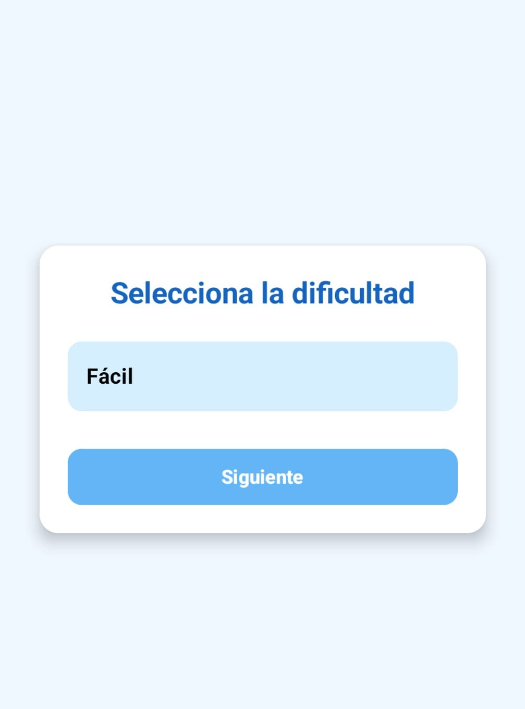
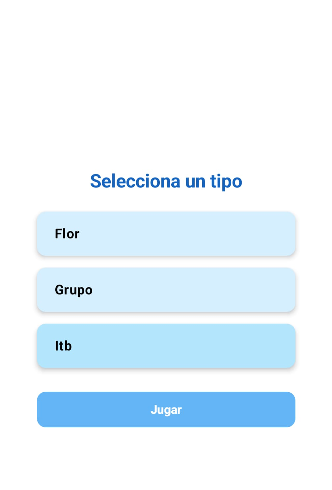
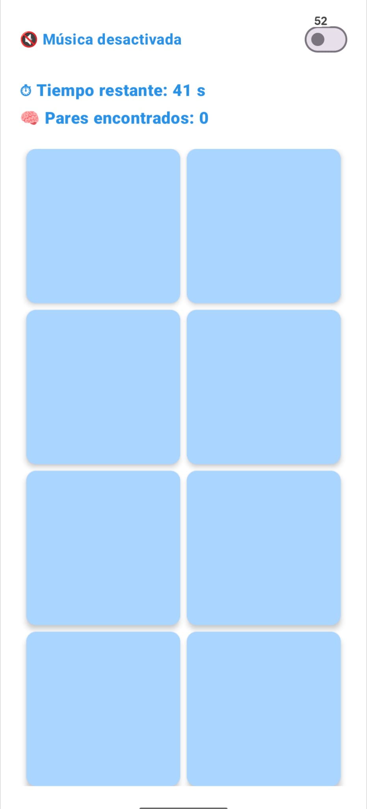
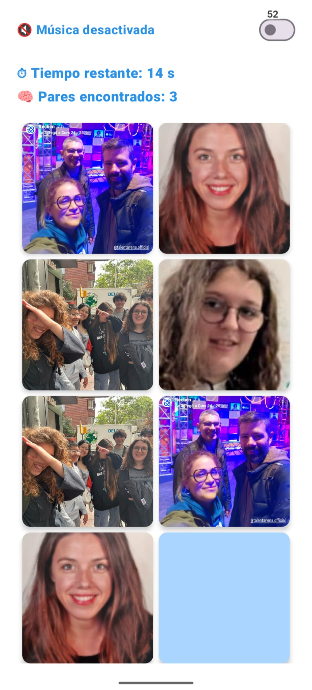
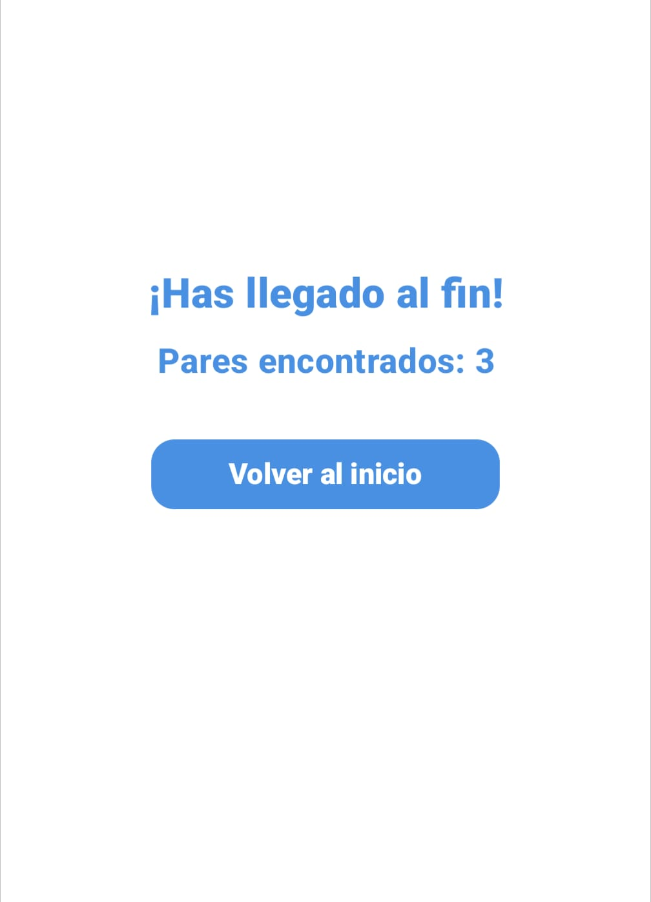
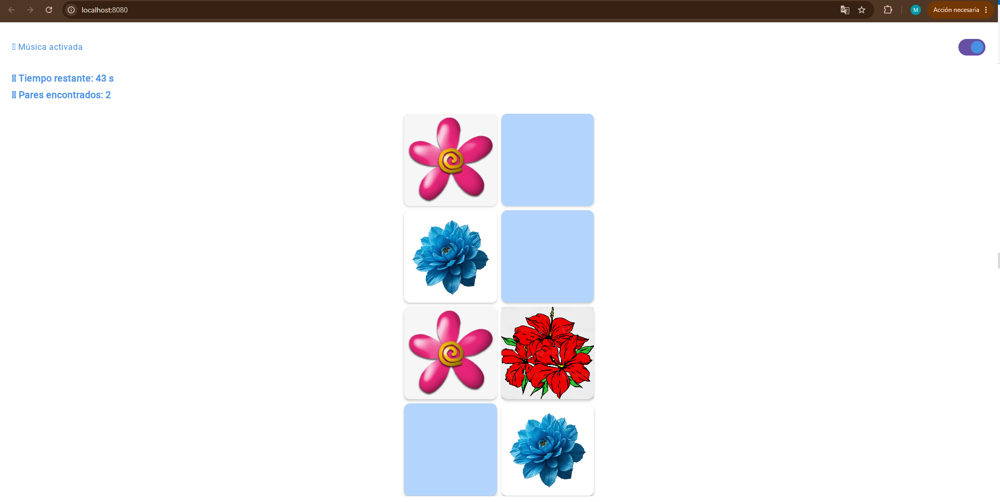
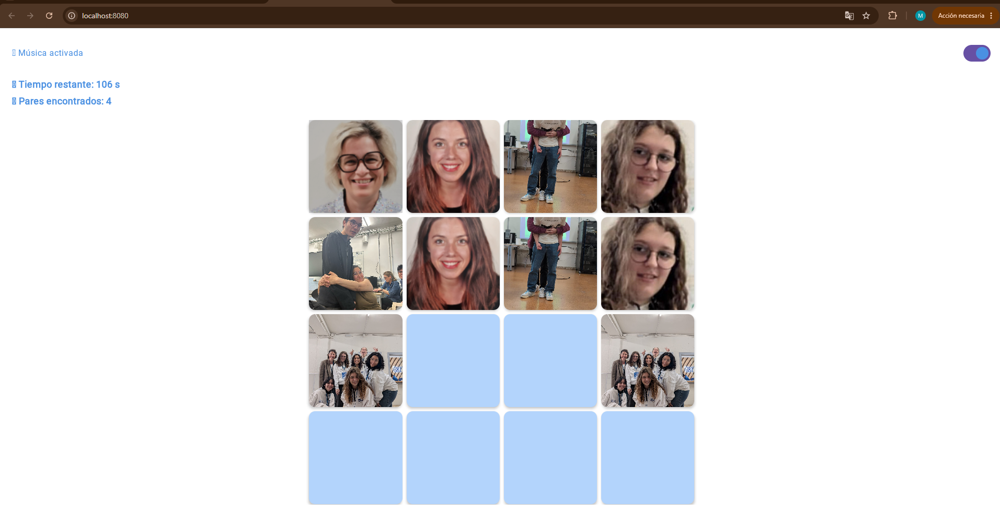

# KMP Memory Game - Juego de Memoria Multiplataforma 

**KMP Memory Game** es una aplicación móvil y web nativa de emparejamiento de cartas, desarrollada utilizando **Kotlin Multiplatform (KMP)** y **Compose Multiplatform**. El proyecto comparte el 100% de la lógica de negocio y la interfaz de usuario entre diferentes plataformas, demostrando la eficiencia del desarrollo de código único (*Single Codebase*).

---

##  Resumen del Proyecto

* **El Desafío**: Crear un juego interactivo de memoria que sincronice estados complejos (temporizador, cálculo de pares encontrados, volteo de cartas y reproducción de audio) garantizando un rendimiento nativo tanto en dispositivos móviles (Android) como en entornos web (WebAssembly).
* **Propósito**: Implementar las capacidades de Compose Multiplatform para renderizar componentes de interfaz reactivos e idénticos en múltiples sistemas sin duplicar código de UI.

---

##  Características Principales

* **Lógica 100% Compartida (`commonMain`)**: Toda la arquitectura de juego, control de turnos, barajado aleatorio de cartas y el sistema de puntuación se gestiona de manera centralizada.
* **Múltiples Modos de Juego (Dificultades)**: Permite al usuario configurar el reto en tres niveles:
  * **Fácil:** Cuadrícula de 2x4 (8 cartas).
  * **Media:** Cuadrícula de 4x4 (16 cartas).
  * **Experto:** Cuadrícula de 4x8 (32 cartas).
* **Tematización Dinámica (Tipos de Cartas)**: El jugador puede elegir la estética visual de las barajas antes de iniciar la partida entre tres variantes: *Flor*, *Grupo* o *Itb*.
* **Multimedia Multiplataforma**: Switch integrado para activar o desactivar la música de fondo del juego de manera global y síncrona.
* **Control de Tiempo Basado en Estados**: Temporizador regresivo en tiempo real adaptado a la dificultad seleccionada.

---

##  Arquitectura Multiplataforma

El proyecto sigue la estructura estándar de **Kotlin Multiplatform**:

* **`/composeApp`**: Módulo core donde reside todo el código compartido de la aplicación.
  * **`commonMain`**: Contiene la lógica del juego, gestión del estado de la UI y los componentes visuales escritos en Compose Multiplatform.
  * **`androidMain`**: Configuraciones específicas para el empaquetado y ciclo de vida en la plataforma Android.
* **`/iosApp`**: Punto de entrada nativo para la compilación en iOS mediante interoperabilidad con Swift/SwiftUI (Estructurado y listo para producción).

---

##  Core Tecnológico

#### Multiplatform Stack
* 
*  
*  

#### Arquitectura de Software
* **MVI / MVVM Pattern:** Gestión del estado del tablero mediante flujos reactivos unidireccionales (*Unidirectional Data Flow*).
* **Resource Sharing:** Gestión unificada de imágenes, fuentes tipográficas personalizadas y archivos de audio a través de la API nativa de recursos de Compose Multiplatform.

---

##  Demostración y Capturas de la Aplicación

  <h3 Vídeo Demostrativo de la App</h3>
https://github.com/user-attachments/assets/2653776f-e544-464b-99b0-1f71c5d3ddd7
  
<em>Exploración de personajes, alternancia de vistas (Grid/Lista) y sistema de favoritos en tiempo real.</em>

    
  ---

  <h3> Capturas de Pantalla (Estructura Simétrica)</h3>

  

    
    
    
    
    
     
     
  

---

##  Autor

* **Michelle Carolina Posligua Contreras** (Product Owner / Fullstack & Mobile Developer)
* **Institución**: Institut Tecnològic Barcelona (ITB)
